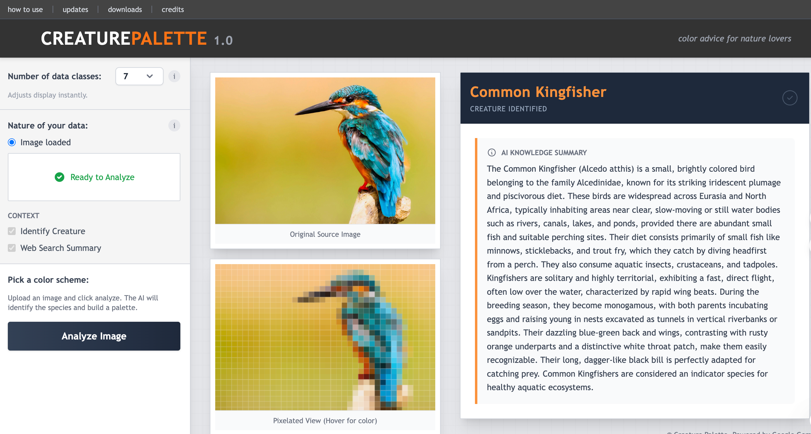
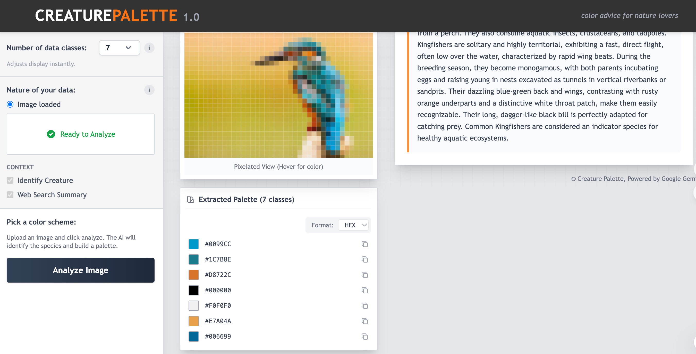

## Project Overview

Creature2Palette is a lightweight web app built with React + Vite that identifies the species in an image and generates the creature’s dominant color palette. It uses Google Gemini to analyze the image and returns:
- Common species name and identification
- A structured, encyclopedic species summary
- A sorted list of dominant colors with HEX / RGB / HSL formats and one-click copy

The app also provides a pixelated preview. Hover to inspect local colors for sampling and design reference.

### UI & Examples

# Run and deploy your AI Studio app

This contains everything you need to run your app locally.

`git clone https://github.com/comery/Creature2Palette.git`

## Run Locally

**Prerequisites:**  Node.js

1. Install dependencies:
   `npm install`
2. Set the `GEMINI_API_KEY` in [.env.local](.env.local) to your Gemini API key, see [how to get your GEMINI API KEY](https://aistudio.google.com/app/api-keys?hl=zh-cn)
3. Run the app:
   `npm run dev`
